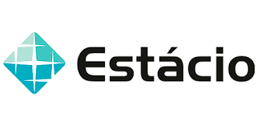

**Nome:** Jonathan Araujo - 202205178111@alunos.estacio.br\
**Curso:** Desenvolvimento Full Stack\
**Período:** 2024.2\
**Professor:** Guilherme Dutra Gonzaga Jaime\
**Disciplina:** Software sem segurança não serve

# Missão Prática Nível 5 Mundo 5

## 🎯 Objetivo do desenvolvimento

Analisar uma falha de segurança, em uma aplicação
web, e aplicar as medidas corretivas necessárias
para garantir o seu correto e seguro funcionamento.

## 🛠 Ferramentas utilizaddas

- Linguagem de programação: JavaScript;
- Biblioteca: Node.js; e
- Versionado através do Git / Github

## 📚 Orientações para executar o app

Para instalar e configurar o ambiente do projeto, siga os passos abaixo:

1. Instalar Node.js:
   [Node.js](https://nodejs.org/en/download/package-manager/current)

2. Clone o repositório:

   ```sh
   git clone https://github.com/Jon-Araujo/softwareHouse.git
   cd softwareHouse
   ```

3. Instale as dependências:

   ```sh
   npm install
   ```

4. Execute o script principal:

   ```sh
   node main.js
   ```
